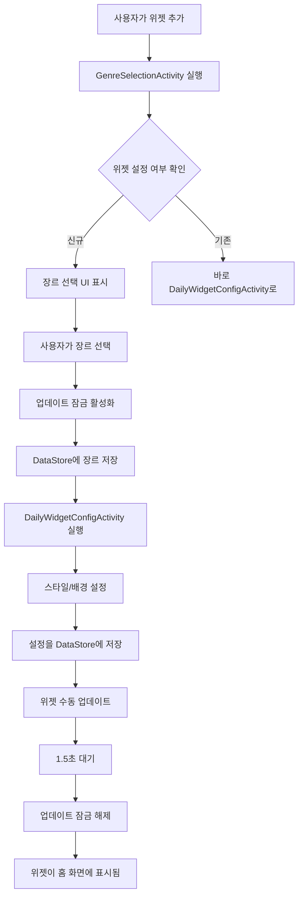

# DailyWidget

<div align="center">

**매일 새로운 영감을 전하는 안드로이드 위젯 앱**

[](https://www.android.com/)
[](https://kotlinlang.org/)
[](https://developer.android.com/jetpack/compose)
[](https://opensource.org/licenses/MIT)

</div>

---

## 📋 목차

- [📱 프로젝트 소개](#-프로젝트-소개)
- [✨ 주요 기능](#-주요-기능)
    - [🎯 위젯 기능](#-위젯-기능)
    - [📝 앱 내 기능](#-앱-내-기능)
- [📸 스크린샷](#-스크린샷)
- [🎮 사용 방법](#-사용-방법)
    - [위젯 추가하기](#위젯-추가하기)
    - [위젯 커스터마이징](#위젯-커스터마이징)
    - [앱 내 기능 사용하기](#앱-내-기능-사용하기)
- [🛠 기술 스택](#-기술-스택)
- [🏗 아키텍처](#-아키텍처)
    - [전체 구조](#전체-구조)
    - [데이터 흐름](#데이터-흐름)
    - [주요 컴포넌트](#주요-컴포넌트)
- [🚀 설치 및 실행](#-설치-및-실행)
- [💡 주요 구현 로직](#-주요-구현-로직)
    - [1. 복수 장르 선택 시스템](#1-복수-장르-선택-시스템)
    - [2. 위젯 메모리 최적화](#2-위젯-메모리-최적화)
    - [3. 업데이트 잠금 메커니즘](#3-업데이트-잠금-메커니즘)
    - [4. 테마 이미지 시스템](#4-테마-이미지-시스템)
    - [5. 백업 및 복원 시스템](#5-백업-및-복원-시스템)
- [🐛 트러블슈팅](#-트러블슈팅)
- [📄 라이선스](#-라이선스)
- [👨‍💻 개발자](#-개발자)

---

## 📱 프로젝트 소개

**DailyWidget**은 사용자가 선택한 장르의 일일 명언과 문장을 홈 화면 위젯으로 제공하는 안드로이드 앱입니다.

### 💎 Main

> 📖 **매일의 영감**: 날짜별로 다른 문장을 자동으로 제공  
> 🎨 **완벽한 커스터마이징**: 10가지 스타일, 다양한 배경, 투명도 조절  
> 🏷️ **유연한 장르 시스템**: 기본 장르 + 사용자 정의 장르 + 복수 장르 선택  
> 🔄 **간편한 관리**: 백업/복원, 문장 CRUD, 자정 자동 업데이트

### 📅 개발 기간
**2025.11.24 ~ 2025.12.10** (약 3주)


---

## ✨ 주요 기능

### 🎯 1. 위젯 기능

<details>
<summary><b>일일 문장 표시</b></summary>

- 날짜(MMdd)별로 필터링된 문장 자동 표시
- 자정(00:00)에 자동으로 다음 날 문장 업데이트
- 문장이 여러 개인 경우 랜덤 선택

</details>

<details>
<summary><b>장르 시스템</b></summary>

#### 1.1 기본 장르
- 소설
- 판타지
- 시

#### 1.2 사용자 정의 장르
- 무제한 추가 가능
- ID 규칙: 영문 소문자, 숫자, 언더스코어
- 표시명: 한글 가능

#### 1.3 복수 장르 선택
- 여러 장르를 조합하여 하나의 위젯에 표시
- 예시: **"소설 & 판타지"** 위젯 → 두 장르의 문장을 모두 표시

</details>

<details>
<summary><b>커스터마이징</b></summary>

#### 1.4 텍스트 스타일
- **10가지 조합**: 색상, 정렬, 굵기, 폰트

#### 1.5 배경 선택
- **단색**
    - 팔레트: 8가지 색상 × 8단계 명도
    - 커스텀: HSV 컬러 피커
- **그라디언트**
    - 4가지 방향: 가로, 세로, 대각선(↘), 대각선(↙)
    - 시작/끝 색상 선택
- **이미지**
    - 테마 이미지: 7개 카테고리 (도시, 하늘, 바다, 자연, 건축, 그림, 기타)
    - 사용자 이미지: 최대 10개, 총 50MB

#### 1.6 투명도
- **범위**: 10%~100%
- **단위**: 5% 스냅

#### 1.7 폰트 크기
| 항목 | 범위 | 기본값 |
|------|------|--------|
| 메인 텍스트 | 8~25sp | 16sp |
| 출처&작가 | 6~20sp | 13sp |
| 특이사항 | 5~15sp | 10sp |

</details>

<details>
<summary><b>위젯 터치 동작</b></summary>

#### 1.8 선택 가능한 동작
1. **다음 문장** (기본값) - 같은 날짜 내에서 다른 문장으로 변경
2. **앱 열기** - 메인 화면으로 이동
3. **공유하기** - 문장 공유 다이얼로그
4. **위젯 설정** - 위젯 편집 화면으로
5. **목록 화면** - 문장 목록 화면으로

> 💡 **Tip**: 터치 동작이 "다음 문장"일 때는 새로고침 버튼이 자동으로 숨겨집니다.

</details>

---

### 📝 2. 앱 내 기능

<details>
<summary><b>문장 관리</b></summary>

#### CRUD 기능
- ✅ 생성: 새 문장 추가
- ✅ 조회: 전체 목록 및 필터링
- ✅ 수정: 기존 문장 편집
- ✅ 삭제: 문장 제거

#### 2.1 필드
| 필드 | 필수 | 설명 |
|------|------|------|
| 텍스트 | ✅ | 메인 문장 내용 |
| 출처 | ⬜ | 책 제목, 영화명 등 |
| 작가 | ⬜ | 작가, 감독 등 |
| 특이사항 | ⬜ | 페이지 번호, 시즌/에피소드 등 |
| 장르 | ✅ | 기본 또는 사용자 정의 장르 |
| 날짜 | ✅ | MMdd 형식 (0101~1231) |

#### 2.2 검색 및 필터링
- 전체 검색 (텍스트, 출처, 작가 통합)
- 장르별 필터링
- 날짜별 정렬

</details>

<details>
<summary><b>장르 관리</b></summary>

#### 2.3 추가
1. 설정 → 장르 관리 → "장르 추가"
2. 장르 ID 입력 (예: `movie_quote`)
3. 장르 표시명 입력 (예: `영화 대사`)

#### 2.4 삭제
- 사용자 정의 장르만 삭제 가능
- 기본 장르(소설, 판타지, 시)는 삭제 불가
- 삭제 시 해당 장르의 문장은 유지됨

</details>

<details>
<summary><b>백업 및 복원</b></summary>

#### 2.5 백업
- **형식**: JSON
- **포함 내용**:
    - 모든 문장 데이터 (기본 + 사용자 추가)
    - 사용자 정의 장르
- **파일명**: `backup_YYYY_MM_DD_HHMMSS.json`

#### 2.6 복원
- **미리보기**: 복원 전 데이터 확인
    - 총 문장 개수
    - 신규 문장 개수
    - 중복 문장 개수

#### 2.7 중복 처리
| 옵션 | 설명 | 추천 |
|------|------|------|
| **건너뛰기** | 중복 무시, 새 문장만 추가 | ✅ 기본값 |
| **덮어쓰기** | 중복된 문장을 새 문장으로 교체 | ⬜ |
| **모두 추가** | 중복 상관없이 전부 추가 | ⬜ |

> ⚠️ **중복 기준**: 날짜 + 장르 + 텍스트 모두 일치

</details>

<details>
<summary><b>스타일 설정</b></summary>

#### 2.8 표시 설정
- 출처 표시 켜기/끄기
- 작가 표시 켜기/끄기
- 특이사항 표시 켜기/끄기

#### 2.9 홈 화면 뷰 모드
- **카드 뷰**: 카드 형태로 표시
- **리스트 뷰**: 목록 형태로 표시

</details>

---

## 📸 스크린샷

### 위젯 예시

| 다양한 스타일 | 배경 예시 | 복수 장르 |
|:------------:|:---------:|:---------:|
|  |  |  |

### 앱 주요 화면

| 홈 화면 | 문장 목록 | 문장 편집 | 설정 화면 |
|:-------:|:---------:|:---------:|:---------:|
|  |  |  |  |

### 위젯 설정 과정

| 1. 장르 선택 | 2. 스타일 선택 | 3. 배경 선택 | 4. 투명도 조절 |
|:------------:|:--------------:|:------------:|:--------------:|
|  |  |  |  |

> 📝 **Note**: 위 이미지는 플레이스홀더입니다. 실제 스크린샷으로 교체해주세요.

---

## 🎮 사용 방법

### 위젯 추가하기

#### Step 1: 위젯 배치
1. 홈 화면 빈 공간을 **길게 누르기**
2. **"위젯"** 메뉴 선택
3. 앱 목록에서 **"DailyWidget"** 찾기
4. 위젯을 홈 화면으로 **드래그**

#### Step 2: 장르 선택
| 화면 | 설명 |
|------|------|
|  | <ul><li>원하는 장르 선택 (체크박스)</li><li>**복수 선택 가능**: 여러 개 체크</li><li>**다음** 버튼으로 진행</li></ul> |

> 💡 **Tip**:
> - 소설만 선택 → "소설 위젯"
> - 소설 + 판타지 선택 → "소설 & 판타지 위젯"

#### Step 3: 스타일 선택
| 화면 | 설명 |
|------|------|
|  | <ul><li>10가지 스타일 중 선택</li><li>각 스타일은 색상, 정렬, 굵기 조합</li><li>미리보기로 확인 가능</li></ul> |

#### Step 4: 배경 선택 (자세한 설명)

##### 🎨 컬러 탭
<details>
<summary><b>팔레트 서브탭</b></summary>

- **특별 색상**: 흰색, 검정 (상단)
- **팔레트**: 8가지 색상 × 8단계 명도 그리드
- 원하는 색상 클릭 → 즉시 적용

</details>

<details>
<summary><b>커스텀 서브탭</b></summary>

- **HSV 컬러 피커**: 자유로운 색상 선택
- 실시간 미리보기
- HEX 코드 표시

</details>

##### 🌈 그라데이션 탭
<details>
<summary><b>그라디언트 설정</b></summary>

1. **시작 색상** 선택 (팔레트 또는 커스텀)
2. **끝 색상** 선택
3. **방향** 선택:
    - 가로 (→), 세로 (↓), 대각선 (↘, ↙)
4. 실시간 미리보기로 확인

</details>

##### 🖼️ 이미지 탭
<details>
<summary><b>테마별 서브탭</b></summary>

**7개 테마 카테고리**:
- 🏙️ 도시, ☁️ 하늘, 🌊 바다, 🌳 자연, 🏛️ 건축, 🎨 그림, ✨ 기타

**사용 방법**:
1. 테마 선택 (예: 도시)
2. 가로 스크롤로 이미지 탐색
3. 원하는 이미지 클릭

</details>

<details>
<summary><b>내 이미지 서브탭</b></summary>

**사용자 이미지 관리**:
- 📊 **제한**: 최대 10개, 총 50MB
- ➕ **추가**: "사진 추가" 버튼 → 갤러리에서 선택
- 🗑️ **삭제**: 각 이미지의 X 버튼
- 🔄 **자동 최적화**: 앱이 자동으로 리사이징

</details>

#### Step 5: 투명도 조절
| 슬라이더 | 설명 |
|---------|------|
|  | <ul><li>**범위**: 10%~100%</li><li>**단위**: 5% 스냅 (85% 맞추기 쉬움)</li><li>실시간 미리보기</li></ul> |

#### Step 6: 위젯 터치 동작 설정
<details>
<summary><b>5가지 옵션</b></summary>

1. **다음 문장** (기본값) ⭐
    - 위젯 터치 시 같은 날짜의 다른 문장으로 변경
    - 새로고침 버튼 자동 숨김

2. **앱 열기** : 메인 화면으로 이동

3. **공유하기** : 문장 공유 다이얼로그

4. **위젯 설정** : 위젯 편집 화면으로

5. **목록 화면** : 문장 목록 화면으로

</details>

#### Step 7: 완료
- **"완료"** 버튼 클릭
- 위젯이 홈 화면에 표시됨

---

### 위젯 커스터마이징

#### 기존 위젯 편집
1. 위젯을 **길게 누르기**
2. **"편집"** 또는 **설정 아이콘** 선택
3. 스타일, 배경, 투명도, 터치 동작 수정
4. "완료" 클릭

> ⚠️ **주의**: 장르는 변경할 수 없습니다. 장르를 바꾸려면 위젯을 삭제하고 다시 추가하세요.

#### 위젯 크기 조정
1. 위젯을 **길게 누르기**
2. 모서리를 드래그하여 크기 조정
3. 폰트 크기가 자동으로 조정됨

---

### 앱 내 기능 사용하기

#### 문장 추가
1. **앱 실행** → 하단 네비게이션 **"목록"** 탭
2. 우측 하단 **FAB(+)** 버튼 클릭
3. 필드 입력:
    - 문장 텍스트 (필수)
    - 출처 (선택)
    - 작가 (선택)
    - 특이사항 (선택)
    - 장르 선택 (필수)
    - 날짜 선택 (필수)
4. **"저장"** 버튼 클릭

#### 문장 편집/삭제
1. **목록** 탭에서 문장 클릭
2. 내용 수정 후 **"저장"** 또는 **"삭제"**

#### 장르 추가
1. **설정** 탭 → **"장르 관리"** 섹션
2. **"장르 추가"** 클릭
3. 입력:
    - **장르 ID**: 영문 소문자, 숫자, 언더스코어 (예: `movie`)
    - **장르 표시명**: 한글 가능 (예: `영화 대사`)
4. **"추가"** 버튼 클릭

#### 백업하기
1. **설정** 탭 → **"백업 및 복원"** 섹션
2. **"백업하기"** 클릭
3. 백업 정보 확인 (총 문장 개수, 장르별 개수)
4. **"백업하기"** 확인
5. 저장 위치 선택 (다운로드 폴더 권장)

#### 복원하기
1. **설정** 탭 → **"백업 및 복원"** 섹션
2. **"복원하기"** 클릭
3. 백업 파일 선택 (JSON)
4. 미리보기 확인:
    - 총 문장 개수
    - 신규 문장 개수
    - 중복 문장 개수
5. 중복 처리 방법 선택 (건너뛰기 권장)
6. **"복원하기"** 확인

#### 폰트 크기 조정
1. **설정** 탭 → **"폰트 크기 설정"** 섹션
2. 각 요소별 슬라이더 조정:
    - 메인 문장: 8~25sp
    - 출처&작가: 6~20sp
    - 특이사항: 5~15sp
3. 실시간 미리보기 확인
4. **"기본값으로 초기화"** 버튼으로 리셋 가능

---

## 🛠 기술 스택

### Language & Framework
| Technology | Version | Purpose |
|-----------|---------|---------|
| **Kotlin** | 1.9.0+ | 주 개발 언어 (100% Kotlin) |
| **Jetpack Compose** | - | 앱 내 UI |
| **RemoteViews** | - | 위젯 UI |

### Architecture & Libraries
| Library | Purpose |
|---------|---------|
| **Room** | 로컬 데이터베이스 (SQLite 기반) |
| **DataStore** | 설정 데이터 저장 (SharedPreferences 대체) |
| **Coroutines** | 비동기 처리 |
| **Flow** | 반응형 데이터 스트림 |
| **Coil** | 이미지 로딩 |
| **Kotlinx Serialization** | JSON 직렬화 (백업/복원) |
| **ClassicColorPicker** | HSV 컬러 피커 |

### Android Components
| Component | Version | Purpose |
|-----------|---------|---------|
| **Min SDK** | 26 | Android 8.0 Oreo |
| **Target SDK** | 34 | Android 14 |
| **AppWidget** | - | 홈 화면 위젯 |
| **AlarmManager** | - | 자정 자동 업데이트 |

---

## 🏗 아키텍처

### 전체 구조

```
┌─────────────────────────────────────────────────────┐
│                Presentation Layer                    │
│  ┌──────────────────────┐  ┌────────────────────┐  │
│  │   Jetpack Compose    │  │   Android Widget   │  │
│  │    (Activities +     │  │    (RemoteViews)   │  │
│  │     Composables)     │  │                    │  │
│  └──────────┬───────────┘  └──────────┬─────────┘  │
└─────────────┼──────────────────────────┼────────────┘
              │                          │
              ▼                          ▼
┌─────────────────────────────────────────────────────┐
│                  Domain Layer                        │
│  ┌──────────────────────────────────────────────┐  │
│  │           Repository Pattern                  │  │
│  │  • DailySentenceRepository                   │  │
│  │  • DataStoreManager                          │  │
│  │  • BackupManager                             │  │
│  └──────────────────┬───────────────────────────┘  │
└─────────────────────┼──────────────────────────────┘
                      │
                      ▼
┌─────────────────────────────────────────────────────┐
│                   Data Layer                         │
│  ┌────────────────┐        ┌──────────────────┐    │
│  │  Room Database │        │    DataStore     │    │
│  │   (SQLite)     │        │  (Preferences)   │    │
│  │                │        │                  │    │
│  │  • Sentences   │        │  • Widget Config │    │
│  │  • DAO         │        │  • Display Config│    │
│  │  • Entities    │        │  • Custom Genres │    │
│  └────────────────┘        └──────────────────┘    │
└─────────────────────────────────────────────────────┘
```

---

### 데이터 흐름

#### 1️⃣ 위젯 추가 플로우



#### 2️⃣ 위젯 업데이트 플로우

```
자정 AlarmManager 트리거
        ↓
DailyWidgetReceiver.onReceive()
        ↓
모든 위젯 ID 조회
        ↓
각 위젯별로 반복:
    ├─ DataStore에서 장르(들) 조회
    ├─ Room DB에서 오늘 날짜 + 장르 필터링
    ├─ 랜덤 문장 선택
    ├─ 스타일/배경 적용
    └─ RemoteViews 업데이트
        ↓
모든 위젯 갱신 완료
```

#### 3️⃣ 복수 장르 데이터 처리

```
사용자가 "소설 & 판타지" 선택
        ↓
DataStore 저장: "novel,fantasy"
        ↓
위젯 업데이트 시:
    ├─ DataStore 조회: "novel,fantasy"
    ├─ 쉼표로 분리: ["novel", "fantasy"]
    ├─ Room IN 절 쿼리:
    │   SELECT * FROM sentences 
    │   WHERE date = "1210" 
    │   AND genre IN ("novel", "fantasy")
    └─ 결과: 소설 + 판타지 문장 모두 반환
        ↓
랜덤 선택 → 위젯 표시
```

---

### 주요 컴포넌트

#### 📦 Widget System

| 컴포넌트 | 역할 |
|---------|------|
| **UnifiedWidgetProvider** | • 모든 장르를 처리하는 단일 위젯 프로바이더<br>• 위젯별 독립적인 장르 설정 관리<br>• 시스템 `onUpdate()` 처리 |
| **DailyWidgetProvider** (추상) | • 위젯 업데이트 로직의 핵심<br>• `updateAppWidget()`: 문장 조회, 스타일 적용, 배경 설정<br>• `updateAppWidgetWithGenres()`: 복수 장르 버전 |
| **GenreSelectionActivity** | • 위젯 추가 시 장르 선택 화면<br>• Checkbox로 복수 선택 지원<br>• 업데이트 잠금 활성화 |
| **DailyWidgetConfigActivity** | • 위젯 스타일/배경 설정<br>• 탭 구조: 컬러, 그라디언트, 이미지<br>• 투명도 슬라이더, 터치 동작 설정 |
| **DailyWidgetReceiver** | • 자정(00:00) AlarmManager 처리<br>• `ACTION_MIDNIGHT_UPDATE` 수신 시 모든 위젯 갱신 |

#### 💾 Data Management

| 컴포넌트 | 역할                                                                                                                        |
|---------|---------------------------------------------------------------------------------------------------------------------------|
| **AppDatabase** | • Room 데이터베이스<br>• 싱글톤 패턴                                                                                                 |
| **DailySentenceDao** | • CRUD 쿼리<br/>• `getSentencesByDateAndGenres()`: IN 절로 복수 장르 조회                                                           |
| **DailySentenceEntity** | • 문장 데이터 모델<br>• 필드: id, text, source, writer, extra, genre, date                                                         |
| **DataStoreManager** | • **위젯 설정**: 스타일, 배경, 장르, 탭 액션<br>• **전역 설정**: 표시 옵션, 폰트 크기<br>• **장르 관리**: 기본 + 사용자 정의<br>• **업데이트 잠금**: 설정 중 자동 업데이트 방지 |
| **BackupManager** | • JSON 백업/복원<br>• 중복 처리 로직<br>• 미리보기 기능                                                                                   |

#### 🛠️ Utilities

| 유틸리티 | 역할 |
|---------|------|
| **StyleManager** | • 10개 텍스트 스타일 관리<br>• 색상, 정렬, 굵기, 폰트 조합 |
| **ThemeManager** | • 7개 테마 카테고리 관리<br>• Assets 폴더 이미지 조회<br>• 경로 파싱: `theme:city/image1.jpg` → `themes/city/image1.jpg` |
| **ImageManager** | • 사용자 이미지 관리 (최대 10개, 50MB)<br>• 자동 리사이징<br>• 용량 체크 |
| **BackgroundConfigModel** | • 배경 ID 파싱<br>• 형식: `solid:#FFFFFF,alpha:0.5`<br>• `gradient:#FF6B9D,#FFC371,horizontal,alpha:0.8`<br>• `image:theme:city/image1.jpg,alpha:0.7` |

---

## 🚀 설치 및 실행

### 📋 요구사항

| 항목 | 버전 |
|------|------|
| **Android Studio** | Hedgehog (2023.1.1) 이상 |
| **Minimum SDK** | 26 (Android 8.0) |
| **Target SDK** | 34 (Android 14) |
| **Gradle** | 8.0+ |
| **Kotlin** | 1.9.0+ |

---

### ⚙️ 빌드 방법

```bash
# 1️⃣ 저장소 클론
git clone https://github.com/yourusername/DailyWidget.git
cd DailyWidget

# 2️⃣ Gradle 동기화
./gradlew sync

# 3️⃣ 빌드
./gradlew build

# 4️⃣ 앱 설치 (디바이스/에뮬레이터 연결 후)
./gradlew installDebug
```

---

### 📁 초기 설정

#### 1. 초기 데이터 확인
- 위치: `app/src/main/assets/sentences.json`
- 앱 최초 실행 시 자동으로 Room DB에 로드됨

#### 2. 테마 이미지 추가 (선택)

테마 이미지를 추가하려면 다음 구조로 배치:

```
app/src/main/assets/themes/
├── city/       # 도시 테마
├── sky/        # 하늘 테마
├── water/      # 바다 테마
├── nature/     # 자연 테마
├── struct/     # 건축 테마
├── paintings/  # 그림 테마
└── etc/        # 기타 테마
```

> 💡 각 폴더에 `.jpg`, `.png` 이미지 파일 추가

#### 3. 위젯 추가
1. 홈 화면 길게 누르기
2. "위젯" 선택
3. "DailyWidget" 찾기
4. 위젯을 홈 화면에 드래그
5. 장르 선택 → 스타일 설정

---

## 💡 주요 구현 로직

### 1. 복수 장르 선택 시스템

#### 🎯 목표
하나의 위젯에서 여러 장르(예: "소설 & 판타지")의 문장을 함께 표시

#### 🔄 데이터 흐름

```
[UI Layer]
Checkbox로 복수 선택
["novel", "fantasy", "poem"]
        ↓
[Repository Layer]
DataStoreManager.saveWidgetGenres()
쉼표로 구분하여 저장
"novel,fantasy,poem"
        ↓
[Storage]
DataStore에 저장
key: "widget_genre_46"
value: "novel,fantasy,poem"
        ↓
[위젯 업데이트 시]
DataStoreManager.getWidgetGenres()
쉼표로 분리
["novel", "fantasy", "poem"]
        ↓
[Database Layer]
Room DAO 쿼리
IN 절 사용
WHERE genre IN (?, ?, ?)
        ↓
[Result]
모든 장르의 문장 반환
랜덤 선택 → 위젯 표시
```

#### 🔑 핵심 로직

1. **저장**
    - UI에서 `Set<String>` 수집
    - `joinToString(",")`로 문자열 변환
    - DataStore에 단일 문자열로 저장

2. **조회**
    - DataStore에서 문자열 조회
    - `split(",")`로 List 변환
    - `filter { it.isNotEmpty() }`로 정제

3. **쿼리**
    - Room의 IN 절 활용
    - 매개변수로 `List<String>` 전달
    - Room이 자동으로 SQL 생성

---

### 2. 위젯 메모리 최적화

#### ⚠️ 문제
Android 위젯은 RemoteViews의 비트맵 메모리 제한이 있음:
- **최대 허용**: 15MB
- **원본 이미지**: 46MB → 초과 시 크래시

#### 💡 해결 전략

```
[원본 이미지 로드]
46MB, 4000x3000px
        ↓
[1단계: 비율 계산]
maxSize = 800px
ratio = min(800/4000, 800/3000)
ratio = 0.2
        ↓
[2단계: 새 크기 계산]
newWidth = 4000 * 0.2 = 800px
newHeight = 3000 * 0.2 = 600px
        ↓
[3단계: 리사이징]
Bitmap.createScaledBitmap()
        ↓
[4단계: 원본 해제]
originalBitmap.recycle()
        ↓
[결과]
5MB, 800x600px
위젯 메모리 제한 준수 ✅
```

#### 📊 효과
- **용량 감소**: 46MB → 5MB (약 90% 감소)
- **품질**: 위젯 크기에 최적화, 육안으로 차이 없음
- **성능**: 메모리 부족 오류 제거

---

### 3. 업데이트 잠금 메커니즘

#### ⚠️ 문제
- 위젯 설정 중 시스템 `onUpdate()` 자동 호출
- DataStore 저장이 완료되기 전에 조회 발생
- 장르가 기본값으로 덮어써짐

#### 🔐 해결: 3단계 잠금 시스템

```
[장르 선택 시점]
        ↓
┌─────────────────────┐
│ 1. 잠금 활성화       │
│ setWidgetUpdateLock  │
│ (appWidgetId, true)  │
└─────────────────────┘
        ↓
┌─────────────────────┐
│ 2. 장르 저장         │
│ saveWidgetGenres     │
│ (id, ["novel", ...]) │
└─────────────────────┘
        ↓
┌─────────────────────┐
│ 3. 설정 화면으로     │
│ DailyWidgetConfig    │
│ Activity 실행        │
└─────────────────────┘

[시스템 onUpdate() 호출]
        ↓
┌─────────────────────┐
│ 잠금 확인            │
│ isWidgetUpdateLocked │
│ → true 반환          │
└─────────────────────┘
        ↓
┌─────────────────────┐
│ 업데이트 스킵        │
│ return (처리 안함)   │
└─────────────────────┘

[설정 완료 시점]
        ↓
┌─────────────────────┐
│ 수동 업데이트        │
│ updateAppWidget()    │
└─────────────────────┘
        ↓
┌─────────────────────┐
│ 1.5초 대기           │
│ delay(1500)          │
└─────────────────────┘
        ↓
┌─────────────────────┐
│ 잠금 해제            │
│ setWidgetUpdateLock  │
│ (appWidgetId, false) │
└─────────────────────┘
```

#### 🔑 핵심 포인트
1. **타이밍**: DataStore 저장은 비동기 → 완료 전에 조회하면 null
2. **잠금**: 설정 프로세스 중 자동 업데이트 차단
3. **대기**: 충분한 시간(1.5초) 확보 후 잠금 해제

---

### 4. 테마 이미지 시스템

#### 📂 구조

```
[Assets 폴더]
themes/
  ├── city/
  │   ├── image1.jpg
  │   └── image2.jpg
  ├── sky/
  │   ├── sunset.jpg
  │   └── clouds.jpg
  └── ...
```

#### 🔄 경로 처리 흐름

```
[저장 시]
사용자가 "도시 > image1.jpg" 선택
        ↓
내부 형식으로 변환
"theme:city/image1.jpg"
        ↓
투명도 포함
"image:theme:city/image1.jpg,alpha:0.7"
        ↓
DataStore에 저장
```

```
[로드 시]
DataStore에서 조회
"image:theme:city/image1.jpg,alpha:0.7"
        ↓
파싱
type: image
isThemeImage: true
imageName: "theme:city/image1.jpg"
alpha: 0.7
        ↓
Assets 경로로 변환
getAssetPath()
"theme:city/image1.jpg" → "themes/city/image1.jpg"
        ↓
Assets 로드
context.assets.open("themes/city/image1.jpg")
        ↓
위젯에 적용
```

#### 📷 사용자 이미지

```
[추가 시]
갤러리에서 이미지 선택 (Uri)
        ↓
앱 내부 저장소에 복사
filesDir/images/user_1234567890.jpg
        ↓
자동 리사이징 (최대 800px)
        ↓
용량 체크 (총 50MB 이내)
        ↓
성공 시 파일명 반환
"file://user_1234567890.jpg"
        ↓
DataStore에 저장
"image:file://user_1234567890.jpg,alpha:1.0"
```

---

### 5. 백업 및 복원 시스템

#### 📦 백업 데이터 구조

```json
{
  "version": 2,
  "exportDate": "2025-12-10",
  "customGenres": [
    {
      "id": "movie",
      "displayName": "영화 대사"
    }
  ],
  "sentences": [
    {
      "date": "0101",
      "genre": "novel",
      "text": "문장 내용",
      "source": "출처",
      "writer": "작가",
      "extra": "추가정보"
    }
  ]
}
```

#### 🔄 복원 흐름

```
[파일 선택]
        ↓
┌────────────────────┐
│ JSON 파싱           │
│ version 확인 (v2)   │
└────────────────────┘
        ↓
┌────────────────────┐
│ 미리보기 생성       │
│ • 총 문장 개수      │
│ • 신규 개수         │
│ • 중복 개수         │
└────────────────────┘
        ↓
┌────────────────────┐
│ 사용자 확인         │
│ (미리보기 다이얼로그)│
└────────────────────┘
        ↓
중복 있음? ─┬─ Yes → 중복 처리 옵션 선택
            │         ├─ 건너뛰기
            │         ├─ 덮어쓰기
            │         └─ 모두 추가
            └─ No ──→ 바로 복원
        ↓
┌────────────────────┐
│ 1단계: 장르 복원    │
│ customGenres 추가   │
│ (중복 시 무시)      │
└────────────────────┘
        ↓
┌────────────────────┐
│ 2단계: 문장 복원    │
│ 선택된 옵션에 따라  │
│ Room DB에 삽입      │
└────────────────────┘
        ↓
┌────────────────────┐
│ 완료 메시지         │
│ "N개 복원 완료"     │
└────────────────────┘
```

#### 🔑 중복 처리 로직

| 옵션 | 로직 |
|------|------|
| **건너뛰기** | 1. 기존 DB 조회<br>2. 날짜+장르+텍스트 일치 체크<br>3. 중복 제외한 신규만 삽입 |
| **덮어쓰기** | 1. 날짜+장르+텍스트 일치 체크<br>2. 중복 발견 시 기존 삭제<br>3. 새 문장 삽입 |
| **모두 추가** | 중복 체크 없이 전부 삽입 (ID는 자동 증가) |

---

## 🐛 트러블슈팅

<details>
<summary><b>1. 위젯 장르가 기본값으로 바뀌는 문제</b></summary>

#### 증상
- "소설 & 판타지" 선택 → 설정 완료 후 "소설"만 표시

#### 원인
- `DailyWidgetConfigActivity`에서 장르를 단일 값으로 덮어씀

#### 해결
- 설정 저장 시 장르는 건드리지 않음
- 스타일/배경만 별도로 저장하는 함수 사용

</details>

<details>
<summary><b>2. 완료 버튼을 여러 번 눌러야 닫히는 문제</b></summary>

#### 증상
- 위젯 설정 완료 버튼을 여러 번 클릭해야 화면이 닫힘

#### 원인
- `delay(1500)` 동안 Activity가 살아있어서 버튼 재클릭 가능

#### 해결
- `finish()` 호출을 `delay()` 이전으로 이동
- 잠금 해제를 백그라운드 코루틴으로 분리

</details>

<details>
<summary><b>3. 배경 이미지/그라디언트가 표시되지 않는 문제</b></summary>

#### 증상
- 그라디언트 선택 시 단색으로 표시
- 테마 이미지 선택 시 표시 안됨

#### 원인 1: 그라디언트 파싱 오류
- `split(",")`로 파싱 시 alpha도 함께 분리됨

#### 해결 1
- alpha를 먼저 추출
- `substringBefore(",alpha:")`로 본문과 분리

#### 원인 2: 테마 이미지 경로
- `"theme:city/image1.jpg"`를 그대로 Assets 경로로 사용

#### 해결 2
- `removePrefix("theme:")`로 전처리
- `"themes/city/image1.jpg"` 형태로 변환 후 로드

</details>

<details>
<summary><b>4. 위젯 메모리 초과 크래시</b></summary>

#### 증상
```
RemoteViews for widget update exceeds maximum bitmap memory usage
(used: 46MB, max: 15MB)
```

#### 원인
- 고해상도 이미지를 리사이징 없이 위젯에 적용

#### 해결
- 최대 800px로 자동 리사이징
- 원본 비트맵 즉시 해제

</details>

---

## 📄 라이선스

이 프로젝트는 **MIT License** 하에 배포됩니다.

<details>
<summary><b>MIT License 전문 보기</b></summary>

```
MIT License

Copyright (c) 2025 Taeiiin

Permission is hereby granted, free of charge, to any person obtaining a copy
of this software and associated documentation files (the "Software"), to deal
in the Software without restriction, including without limitation the rights
to use, copy, modify, merge, publish, distribute, sublicense, and/or sell
copies of the Software, and to permit persons to whom the Software is
furnished to do so, subject to the following conditions:

The above copyright notice and this permission notice shall be included in all
copies or substantial portions of the Software.

THE SOFTWARE IS PROVIDED "AS IS", WITHOUT WARRANTY OF ANY KIND, EXPRESS OR
IMPLIED, INCLUDING BUT NOT LIMITED TO THE WARRANTIES OF MERCHANTABILITY,
FITNESS FOR A PARTICULAR PURPOSE AND NONINFRINGEMENT. IN NO EVENT SHALL THE
AUTHORS OR COPYRIGHT HOLDERS BE LIABLE FOR ANY CLAIM, DAMAGES OR OTHER
LIABILITY, WHETHER IN AN ACTION OF CONTRACT, TORT OR OTHERWISE, ARISING FROM,
OUT OF OR IN CONNECTION WITH THE SOFTWARE OR THE USE OR OTHER DEALINGS IN THE
SOFTWARE.
```

</details>

---

## 👨‍💻 개발자

<div align="center">

### Taeiiin

[](https://github.com/taeiiin)
[](mailto:taein.k0103@gmail.com)

</div>

---

<div align="center">

**Built with using Kotlin & Jetpack Compose**

</div>